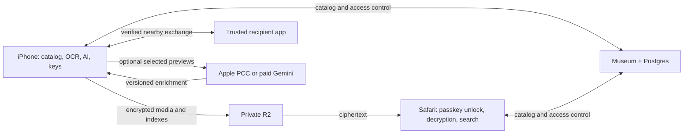

**Fotoro — iPhone, cross-device sync, Safari, and trusted sharing**

Updated September 30, 2026. The fork is published on `dakshbhatia/fotoro`, branch
`codex/ai-photos`. The account-connected Fotoro web canvas, separate intelligence
preview and Museum/Postgres/object-storage stack run. Local upload, browser
catalog restoration and one original digest round trip pass; unsigned iOS builds
and Simulator startup have been verified. Public app
deployment, physical-device benchmarks, and cross-device interoperability remain
unfinished. The architecture below includes planned work; see `README.md` and
`verification.md` for implemented behavior, and `deployment.md` for hosting.

**Recommendation: start from Ente and build the distinctive experience.**

The expanded requirements change the earlier native-app recommendation. For a small team moving quickly, propose a maintained fork of [ente/ente](https://github.com/ente/ente): Flutter mobile, React/TypeScript web, Go Museum server, Postgres, and its shared Rust components. Keep its encryption, media catalog, transfers, and clients together. Add small Swift plugins for current Apple capabilities.

This assumes an AGPL-compatible product. A closed-source product needs a separately implemented Swift/web stack with licensed dependencies and a larger build. Wrapping Ente in a new UI does not remove its license obligations. Immich remains an alternative for a server-readable, self-hosted family library; Ente better fits this encrypted personal service.

The product opens into useful photos immediately, becomes smarter while idle, works across devices, and makes trusted exchange effortless. The first milestone includes Safari and a second device.

**Reuse versus new work**

| Need | Reuse | Build or prove |
|---|---|---|
| Encrypted backup and cross-device catalog | Ente clients, Museum, encryption and recovery | R2 integration, resource round trips, interruption handling |
| Fast gallery | Existing mobile/web galleries and thumbnail caches | Profile real libraries; remove work from scrolling |
| EXIF and OCR | Existing metadata pipeline and iOS Vision OCR plugin | Incremental searchable OCR, provenance, quick metadata tags |
| Natural-language search and people | Local ML, clustering, encrypted index transport | Model rights/performance; hybrid search; Safari retrieval |
| Cleanup | Exact-duplicate and storage tools | Near-duplicate review, burst keepers, verified-backup cleanup |
| Passkey magic | Existing WebAuthn infrastructure | Primary authentication plus encrypted-library unlock |
| Trusted nearby sharing | Accounts, contacts, album sharing | Native proximity transport, grants, receiving, expiry |
| Private video playback | Existing encrypted streaming path | Safari/iPhone seeking tests; derivative cost accounting |

Ente documents passkeys as a **second factor** and currently excludes ML search from web. Those are explicit additions. Its encrypted indexes already sync between supported ML clients. [Passkeys](https://ente.com/help/photos/features/account/passkeys), [ML platform support](https://ente.com/help/photos/features/search-and-discovery/machine-learning).

Source inspection found `mobile/apps/photos/plugins/ente_vision`, shared models under `rust/crates/ml`, and desktop-dependent web retrieval. `index.ts` gates ML support on desktop; `clip.ts` calls an Electron text encoder. Safari requires a browser implementation of that dependency, not a feature-flag change. [ML entry point](https://github.com/ente/ente/blob/main/web/packages/new/photos/services/ml/index.ts), [retrieval code](https://github.com/ente/ente/blob/main/web/packages/new/photos/services/ml/clip.ts).

**One coherent stack**

| Layer | Proposed choice |
|---|---|
| iPhone | Ente Flutter app; existing PhotoKit integration and SQLite/Rust persistence |
| Apple additions | Swift plugins: Foundation Models, AuthenticationServices, Wi-Fi Aware, background tasks |
| Safari | Ente React/TypeScript web; workers for decryption/search; reconstructible IndexedDB catalog |
| Server | Museum/Go and existing Postgres schema; extend for key envelopes and sharing grants |
| Objects | Private Cloudflare R2 through existing S3 integration; verify CORS, ranges, multipart |
| AI backfill | Client-owned jobs; optional authenticated paid-Gemini adapter with durable job tracking |
| Video | Existing encrypted streaming; preserve originals; optional Mux for provider-readable sharing |

Pin an upstream release and isolate additions into plugins, adapters, migrations, and feature modules. Reuse Ente accounts: adding Supabase Auth alongside them creates another identity and key-enrollment problem. Run Go in a suitable service/container runtime; using R2 does not imply running Museum in a Cloudflare Worker.

**Make snappy measurable**

Render cached photos and metadata before sync/indexing finishes. Decode thumbnails at grid resolution, prefetch a bounded viewport, and preserve scroll position as results arrive. Run decryption, inference, EXIF parsing, hashing, and clustering off the UI thread. Browsing and sending a selection take priority over backfills.

Proposed prototype targets: cached first screen within one second; warm local search p95 under 500 ms at 50,000 assets; scrolling at the device's refresh rate without sustained hitches; no whole-library decoding or original downloads just to display the grid. Validate on actual recent and older supported iPhones. Measure memory, battery and thermal behavior alongside latency. These are targets, not measured results.

Start with Library, Search, People, and a Share action. Cleanup presents useful, reviewable groups and a keeper choice. Sync distinguishes locally available, indexed, uploaded, and verified. Preserve context through face naming, filters and confirmations; use motion/haptics to explain actions. Photos appear immediately and search quality improves over time.

**Tiered, asynchronous AI**

| Tier | Work | When |
|---|---|---|
| 0: metadata | Dates, authorized locations, camera, dimensions, screenshots, duration, resource relationships | First discovery |
| 1: cheap local analysis | Vision OCR/classification, similarity candidates, face localization | Incremental bounded-image jobs |
| 2: retrieval | Licensed image/text embeddings, face embeddings and clustering | New/changed resources; reuse compatible synced results |
| 3: local understanding | Structured scene/activity descriptions using Apple's on-device Foundation Models | Eligible iOS 27 devices; benchmark battery and quality |
| 4: optional cloud | PCC for difficult interactive requests; paid Gemini batch for selected backfills | Explicit cloud setting and budget |

New in iOS 27: Foundation Models accepts image attachments and structured output. Benchmark it before shipping another large captioning model. Check OS, device, language/region and availability; the baseline app works without Apple Intelligence. Image descriptions do not replace a consistent semantic embedding space. [Multimodal prompting](https://developer.apple.com/documentation/foundationmodels/analyzing-images-with-multimodal-prompting), [Attachment availability](https://developer.apple.com/documentation/foundationmodels/attachment).

PCC has no cloud API charge for eligible Small Business Program developers with fewer than two million first-time downloads across their apps and the required entitlement. Daily user quotas and device/region requirements apply. Use it for occasional reasoning, not an assumed unlimited library sweep. [Eligibility](https://developer.apple.com/private-cloud-compute/), [integration and quotas](https://developer.apple.com/documentation/foundationmodels/adding-server-side-intelligence-with-private-cloud-compute).

Each job records source version, operation, model/prompt/schema revision, state, checkpoint, retries and cost. Prioritize selected/new/recent photos, then older backlog. Pause under thermal pressure or low battery. Preserve manual corrections separately. Late results cannot resurrect deleted assets or overwrite corrections. Never route local-only users to cloud silently; choose escalation using evaluated task quality, not a model's uncalibrated confidence claim.

On iOS 26+, evaluate `BGContinuedProcessingTask` for a user-started indexing session with progress/checkpoints. Use opportunistic processing for later increments and background URLSession for file transfers. Runtime remains OS-controlled. [Continued processing](https://developer.apple.com/documentation/backgroundtasks/bgcontinuedprocessingtaskrequest).

The user chose **`gemini-3.8-flash`** on September 30, 2026, prioritizing quality over the small cost difference. Use this pinned image-understanding model with low thinking; 3.8 does not support minimal thinking. The listed 3.8 Flash-Lite variant is TTS. Send stripped previews, compact outputs and one asset per request. Cache results; persist provider batch IDs and reconcile ambiguous submissions before retrying. [Model](https://ai.google.dev/gemini-api/docs/models/gemini-3.8-flash), [Batch API](https://ai.google.dev/gemini-api/docs/batch-api).

Paid Gemini terms exclude submitted content from product improvement but include limited operational/safety handling. Selected previews are disclosed to the provider. Keep secrets off clients and previews out of logs. [Paid-service terms](https://ai.google.dev/gemini-api/terms).

**Search that also works in Safari**

Combine semantic ranking with OCR, dates, places, albums and user-named people. “Mum at the beach last summer” becomes a person/date filter plus semantic retrieval. Use deterministic parsing for common filters and optional local-model parsing for harder requests; generation need not precede every search.

Index resources on an authorized phone/desktop and sync encrypted derived records. Safari decrypts them, encodes the query locally, and ranks the synced image vectors. Named-person queries use membership records without browser face inference. Text/date/album search works while the query model initializes.

Prototype [ONNX Runtime Web](https://onnxruntime.ai/docs/tutorials/web/) in a worker: WASM baseline, WebGPU when the exported model/device support it. Verify tokenizer, normalization, quantization error, model revision and dimension across clients. Different embedding spaces cannot be mixed. [Safari 27's WebGPU changes](https://webkit.org/blog/18325/webkit-features-for-safari-27-0/) make current testing worthwhile; they do not establish our model's compatibility.

Keep browser caches bounded and reconstructible; handle storage eviction. Safari cannot continuously back up the iPhone Photos library from a closed tab. Web imports use explicit file selection/drop; native clients handle library access. Test first-load, HEIC preview fallback, video playback and memory. Use synced OCR/descriptions as useful fallback search, without calling it full semantic parity.

**Passkeys authenticate and unlock**

Target flow: create an account with a passkey, save recovery, unlock the same library on iPhone or Safari with Face ID/Touch ID. Server authentication and library decryption are separate requirements.

Extend Ente's Go WebAuthn path for primary sign-in. Use a stable relying-party domain, allowed origins and native `webcredentials` associated domains. Verify server challenges, origin, RP and user verification; bind enrollment to account identity. Use AuthenticationServices natively and WebAuthn in Safari. [Apple integration](https://developer.apple.com/documentation/authenticationservices/supporting-passkeys).

Prototype PRF-capable passkeys: apply a purpose-specific KDF to the client-only PRF result and wrap the **existing random library master key**. Store a versioned encrypted envelope per credential; never send PRF output to the server. Adding a credential adds a wrapping slot, not a library-wide re-encryption. [Apple PRF support](https://developer.apple.com/documentation/updates/authenticationservices), [envelope-encryption reference](https://developers.yubico.com/WebAuthn/Concepts/PRF_Extension/Developers_Guide_to_PRF.html).

The first auth spike must prove native-to-Safari derivation and unlock for the same credential. Check returned capabilities instead of assuming every authenticator supports PRF. Non-PRF credentials need approval from an unlocked device or recovery. Keep existing recovery during migration. Test new browsers, cleared storage, lost devices, additional credentials and revocation.

A synced account passkey is separate from a device's transfer identity. Revocation blocks future authorized access but cannot erase keys/photos already obtained. Web encryption trusts the code delivered by our origin; minimize third-party scripts and secure that delivery.

**Metadata, dedupe, and real cleanup**

Preserve original bytes. Model Live Photos, RAW/JPEG pairs and edits as related resources. Record capture wall time, available timezone offset, orientation, HDR/color space, camera fields and provenance. Missing timezone stays unknown. Derived tags and guessed places never overwrite source facts. PhotoKit IDs are local source references, not global IDs.

Reuse exact dedupe, then test cross-device imports and filename differences. Perceptual hashes/feature similarity propose near-duplicate groups; rank by resolution, blur, exposure and face quality, then let users choose keepers. Preserve edits and paired resources. [Upstream dedupe behavior](https://ente.com/help/photos/features/backup-and-sync/duplicate-detection).

Expose distinct actions: clear this app's cache; remove reviewed Apple Photos items after verified backup; delete from the cloud library. “Verified” requires a tested restore and digest check. Removing an album reference does not reclaim media bytes.

PhotoKit deletion needs review/system authorization. iCloud Photos deletion propagates to other devices; Recently Deleted normally retains items for 30 days. Show eligible bytes separately from immediately reclaimed local space, particularly with optimized originals. [Apple deletion behavior](https://support.apple.com/guide/iphone/delete-or-hide-photos-and-videos-iphb4defbde9/ios).

**Sync one private library**

Extend existing reconciliation. Persist an outbox for corrections, people names, memberships and sharing operations; add stable operation IDs, revision checks and tombstones where needed. Permission loss removes inaccessible local search results without issuing cloud deletes. Source deletion, cloud deletion and recipient copies have distinct semantics.

Version encrypted indexes by resource/model space. Preserve face merge/split corrections through reindexing. Keep person IDs owner-scoped; sharing does not export the whole face database. Detect user-edit conflicts; do not let the last AI result win automatically.

R2 receives ciphertext and opaque object IDs. Reuse existing crypto/key hierarchy. Prove upload interruption, range/multipart behavior and original plaintext digests after restoration. An ETag is not automatically a content checksum. Keep recipient keys separate from owner recovery keys.

**Trusted sharing**

| Relationship | Default scope | End condition |
|---|---|---|
| Family | Persistent contact trust; selected shared album or exchanges | Revocable; no implicit whole-library access |
| Friend | Receive selected photos in a 15-minute session | Further exchange expires; received photos remain |

The friend behavior is a working assumption awaiting preference. Temporary viewing is a different mode; downloaded/saved pixels cannot reliably be revoked.

Use Wi-Fi Aware plus DeviceDiscoveryUI for native pairing/direct transfer. It requires iOS 26+ and supported hardware, including iPhone 12 or later. Check capabilities. Device pairing secures the link; app account/device verification grants the selected scope. Safari uses authenticated encrypted cloud sharing, not assumed access to native proximity APIs. [Wi-Fi Aware](https://developer.apple.com/documentation/wifiaware), [DeviceDiscoveryUI](https://developer.apple.com/documentation/devicediscoveryui).

Use Network framework for transport/fallbacks. Multipeer Connectivity is now deprecated. Wi-Fi Aware plus QUIC is unsupported before iOS 27; retain a tested TLS/TCP path for iOS 26. Keep system share sheet/AirDrop as an additional fallback. Bluetooth is not the bulk-photo channel. [Apple migration guidance](https://developer.apple.com/documentation/technotes/tn3213-moving-from-multipeer-connectivity-to-network-framework).

Flow: verify contact identity with account binding and QR/PIN → grant recipients/devices a selected-resource scope and expiry → preview/accept → resumable encrypted transfer → digest verification → ingest/dedupe → acknowledge. Check expiry when authorizing further chunks, cancel queued exchanges at expiry, and require a new grant to resume afterward. Use server time online and bounded monotonic leases for active offline sessions.

Offline revocation cannot reach a disconnected recipient instantly. Bound offline permission and reconcile when connected; rotate future-content keys after family access changes. Begin with foreground pairing, not a continuous background radar promise. Test two physical iPhones. [Apple peer-to-peer sample](https://developer.apple.com/documentation/wifiaware/building-peer-to-peer-apps).

Later, opt-in local “photos of you” suggestions can propose selections for an enrolled contact. Explicit approval remains the initial sharing flow.

**Video: reuse the encrypted path first**

Ente documents encrypted HLS playback on mobile, desktop and web. Its current derivative is 720p H.264 at 2 Mbps; preserve originals and verify seeking/startup rather than assuming HDR/original-quality streaming. [Encrypted video streaming](https://ente.com/help/photos/features/utilities/video-streaming).

R2 stores media; it does not resize/transcode. Use existing client/desktop generation and FFmpeg integration first; benchmark AVFoundation/VideoToolbox if changing native generation. Mux is optional for deliberately provider-readable streaming and adds processing/storage/delivery costs. For video search, begin with timestamped sampled frames and optional transcripts; evaluate missed brief events.

**Repositories and your existing work**

| Repository | Role |
|---|---|
| [ente/ente](https://github.com/ente/ente) | One proposed product fork: mobile/web/server, encryption, media |
| [go-webauthn/webauthn](https://github.com/go-webauthn/webauthn) | Extend the existing Go auth path |
| [microsoft/onnxruntime](https://github.com/microsoft/onnxruntime) | Browser query encoder and existing native runtime |
| [google-research/big_vision](https://github.com/google-research/big_vision), [SigLIP2 weights](https://huggingface.co/google/siglip2-base-patch16-224) | Apache-2.0-listed replacement candidate; prove phone/web export, quality, footprint |
| [opencv/opencv_zoo SFace](https://github.com/opencv/opencv_zoo/blob/main/models/face_recognition_sface/README.md) | Apache-2.0-listed face-embedding alternative; prove alignment/cluster quality |
| [apple/coremltools](https://github.com/apple/coremltools) | Custom-model export and numerical parity |
| [FFmpeg/FFmpeg](https://github.com/FFmpeg/FFmpeg) | Media tooling; pin selected build/features |
| [MasterKale/SimpleWebAuthn](https://github.com/MasterKale/SimpleWebAuthn) | Option for a separate TypeScript build, not another server beside Museum |
| [immich-app/immich](https://github.com/immich-app/immich) | Alternative foundation for self-hosted/server-readable libraries |

**Concrete model dependency:** Ente's current catalog references MobileCLIP S2. Apple's currently published model terms restrict product development/commercial use; its MIT source license is separate. Verify rights for the pinned checkpoint or replace it before relying on it in this product. Another app's inclusion does not establish permission. Preserve the pipeline while resolving the model. [Ente catalog](https://github.com/ente/ente/blob/main/rust/crates/ml/src/assets.rs), [Apple model terms](https://github.com/apple-aiml-research/ml-mobileclip/blob/main/LICENSE_MODELS).

Adapt Brain's PhotoKit permission/change-observer patterns, Hermes' R2/EXIF mechanisms, and slop4friends' Google adapter patterns. Brain's examined reader is recent metadata, not this complete pipeline; Hermes' Mac-derived facts do not expose an iOS People index. Keep one coherent backend. If this becomes a Brain feature, extend its mandated backend rather than adding Museum to Brain.

For future personal-agent integration, retain typed asset/search/selection contracts. An authorized client tool can search while holding decryption keys; an encrypted server cannot answer plaintext photo questions alone. New sharing and destructive cleanup need a reviewed selection.

**Cost and implementation order**

R2 Standard lists $0.015/GB-month and free internet egress, with operations separate. 100 GB of originals is about $1.50/month per owner, before derivatives, recovery copies, database/service hosting and other costs. [R2 rates](https://developers.cloudflare.com/r2/pricing/).

At an assumed 1,000 input plus 200 total output tokens per photo, 10,000 3.8 Flash requests cost approximately $15 standard or $7.50 batch through December 31, 2026; published rates double January 1, 2027. These are illustrative workloads, not measured image charges; thinking counts toward output usage. Local AI still consumes battery/runtime. [Google pricing](https://ai.google.dev/gemini-api/docs/pricing).

1. **Foundation proof.** Pin a release, run Museum/Postgres/web, connect a development mobile build and R2 test bucket. Import fixtures with HEIC, edits, Live Photos and video. Prove two-device/Safari original round trips before changing crypto/UI.
2. **Resolve early unknowns.** Prototype native-to-Safari passkey/PRF unlock and Safari retrieval against phone-generated vectors. Resolve checkpoint rights/export choice. Keep recovery available and use isolated test accounts.
3. **One joyful slice.** Cached gallery → metadata/OCR → natural query → select → encrypted sync → same results/corrections in Safari. Profile 10k/50k libraries on actual phones. Backfills never block browsing.
4. **Sharing differentiator.** Two iPhones exchange selected resources, resume interruptions, verify digests and expire a friend's grant. Add scoped family sharing and explicit cloud fallback; reject substituted recipients and expired grants.
5. **Cleanup and richer AI.** Reviewable exact/near-duplicate groups, keeper choice, verified-backup cleanup; native multimodal tags; bounded PCC/Gemini. Preserve corrections and reject stale jobs.
6. **Recovery and playback.** New-device recovery, browser eviction, offline edits, permission changes, deletion propagation, seeking and cost visibility.

A hackathon demo can use a small selected library, manual imports and existing recovery while the new integrations mature. Full-library reliable backup, passwordless recovery and background behavior need their own evidence. The build is one existing product foundation plus focused integrations and polish.
